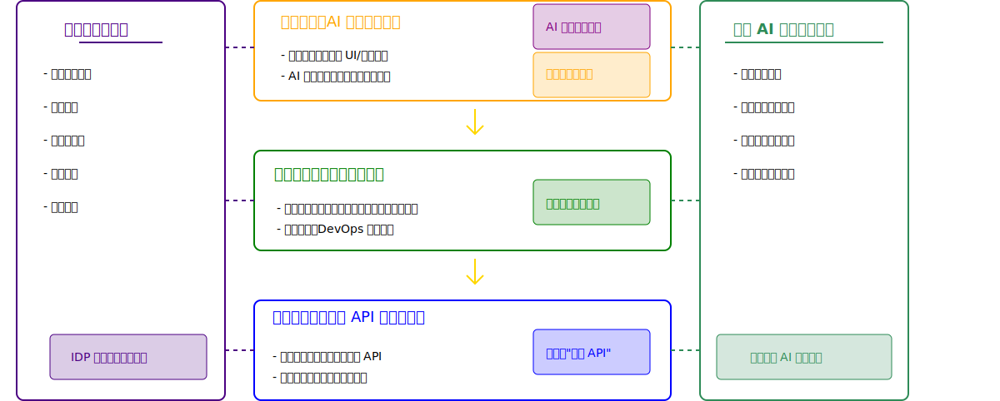
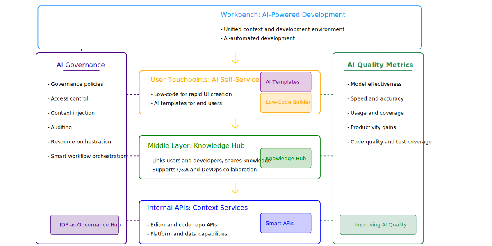

# AutoDev Workbench

> **AutoDev Workbench** is an AI-native developer platform designed to accelerate, automate, and contextualize modern
> software development workflows. It serves as your intelligent, unified workspace for building, debugging, learning, 
> and collaborating — all powered by large language models.

[](https://github.com/unit-mesh/autodev-work/actions/workflows/ci-cd.yml)


## Overview

Architecture



Architecture (English)



AutoDev Workbench provides a unified platform for development teams to:

- **AI-Powered Development**: Leverage advanced AI tools and models to assist in coding, debugging, and problem-solving
- **Knowledge Management**: Centralize and organize development knowledge, patterns, and best practices
- **Workflow Automation**: Streamline development processes through intelligent automation and pattern recognition
- **Metrics & Analytics**: Track and analyze development performance and productivity metrics
- **API/Components Marketplace**: Access a marketplace of reusable components and libraries to accelerate development
- **Documentation**: Maintain comprehensive documentation with AI-assisted content generation and management

## Usage

### AutoDev Context Web

### AutoDev Context Worker

```bash
npx @autodev/context-worker@latest
```

### Release

```bash
git fetch --tags
pnpm install
pnpm publish-all
# Please do `publish-all` first
pnpm publish-all:confirm
git push --tags
```